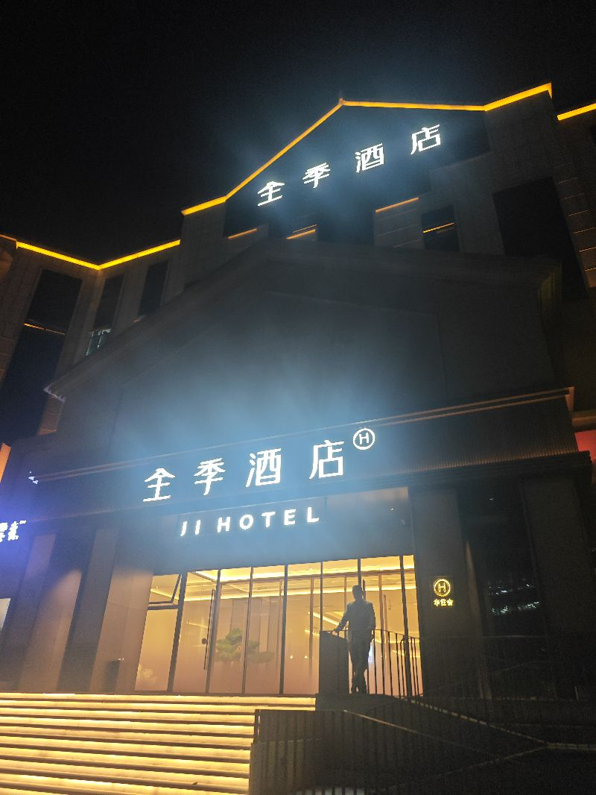

这个酒店全季酒店刚刚装修过，在万业萧条的时候，人家已经实现了各种逆袭了，真的很神奇，这是这就是嗯就是总有一些人做的很好，其实这就叫什么任何一个嗯既在谷底的时候，就会是一个最大的时机，总会有人逆势腾飞，为什么会这样，这就是自然界的规律，这也是嗯世间一切万物皆是波峰，波谷都是波，包括这种经济，包括各种形式，嗯，也就是说既然是波的话，那么你在谷底的时候，别人可能已经在快速上腾期了，但是呢这些有资本的人最喜欢的其实就是经济危机嘛，对他们来讲，这个时候可以低价揽到很多的这种好的资产，

