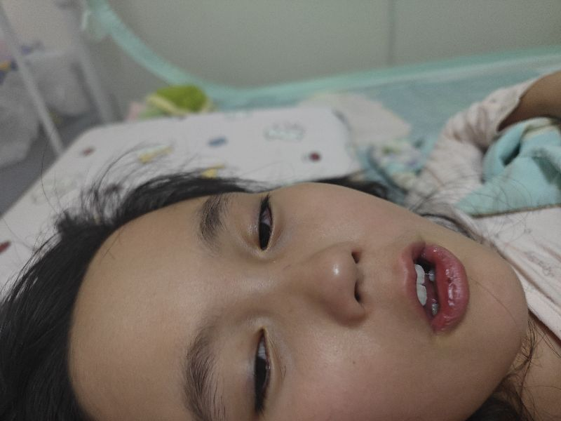

小家伙今天烧到了三十九度多，这个体质啊不够好，真的是一个大问题，后面呢我要带他好好的锻炼，嗯，就是人不锻炼炼光呢，天天在家里边憋憋跟跟老憋似的这样几乎不可能获得太大的提升，一个人要想成功，嗯，几乎一定是身体足够好，这样身体如果不好成功，功概率可能会降低百分之八十十，就是一个人如果精力极其分大，因为他成功的概率会提高很多倍，因为他只要在一个方向上钻下去，几乎能成功，几乎任何方多怕的就是这儿干一下，那样干一下一样呢，如力力力分散散，但是是一个这个精力不不好的人，那么要想让他强难度就很大，

