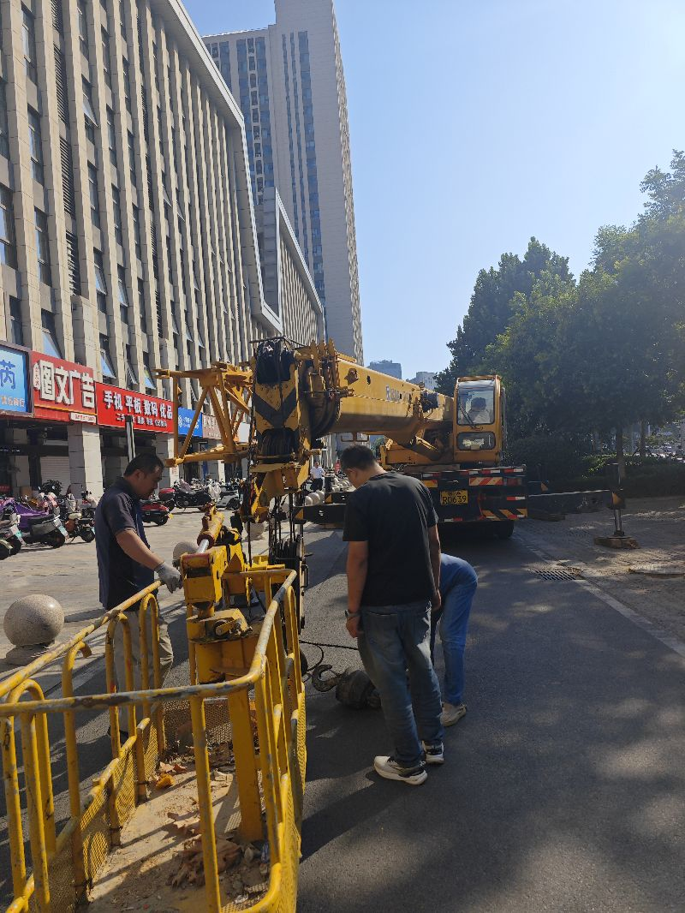

嗯，一直在想到底什么算人工智能机械手，其实吊车不就是人工智能机械手吗，它的零它的一个度、两个度、三个度，比如说它其实这个度七个度好，八个度，它其实是拥有八个度的这种吊车，它的只是它在各种度上的限制比较比比如说横向这个度就是叫什么呃，x轴y轴，它是比如说x轴的这个运动是单向的，然后呢，这个某些地方有旋转的嘛，有哦，它有我刚才还少算一个度，它还有个绞盘，下面还有个最底盘，它这个可以旋转的，也就是它可能设备八个度，这已经比那个我们看到的六轴机器人度还要多一些，也就它可能是有就在我们身边，这就是可能最原始的机器人吧，我一直在想，

