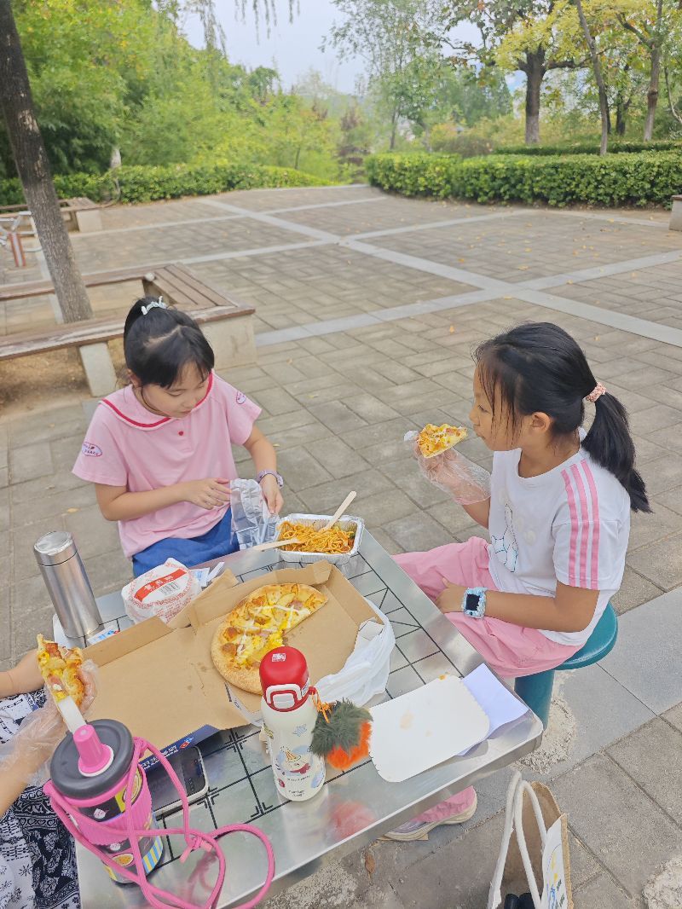
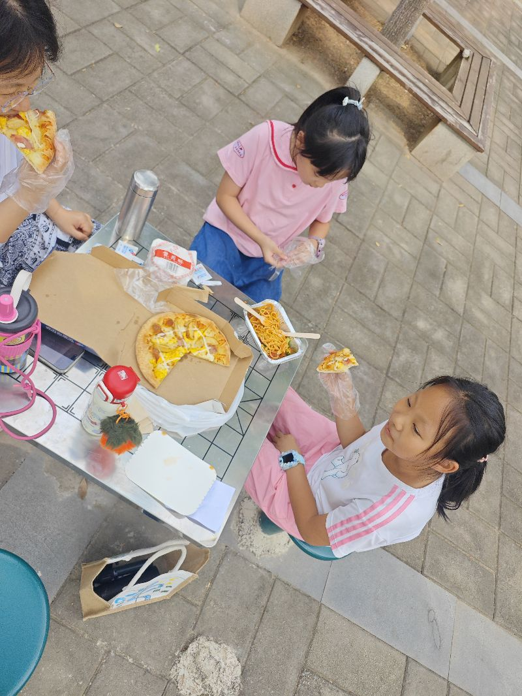

短视频了吗，不是带孩子来爬山，结果到山上一秒钟，两个人就开始吃起来了，这些你们到底是来干啥的，是来是来减肥的，还是来增肥肥的，实幸福本往是健身的，变成了增肥的，嗯，特有意思思就算是我们嗯他们来讲是不具备一贯性，就是很多时候都是随性而玩，也恰恰这就是我们人生幸福的一个基础条件，其实假如说我们时刻都是在计划中的，就算是我们嗯非常的自律啊，也非常的沉浸，但往往我们并不幸福，因为幸福往往是来源于一系列的惊喜，而不是一切已经已已经注定，

