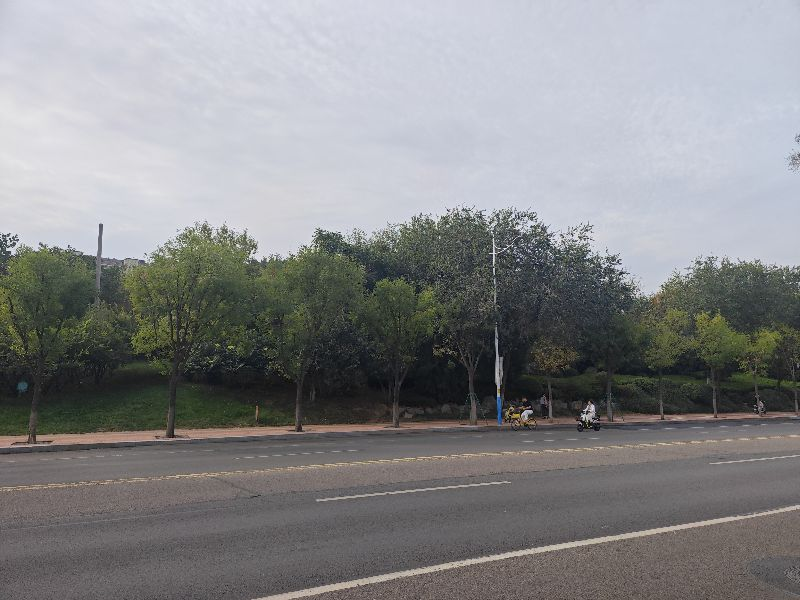

我也要强迫自己每天都要在人工智能领域，在机器人领域有所学习和思考，当然还有另外一个领域，就是哲学领域，而什么呢，因为我觉得这是因为我互相促进，同时又互可替代的三个重要的方向，人工智能和机器人有可能是一回事，但也有可能是互相促进的两个大方向，而哲学呢这是一切无法用科学语言解释的思考的是我们，而人工智个很神奇的东西啊，就是当我们用我法用科学的方式来进行证明和处理的时候，统一都会被化为哲学的领域，而机器人呢是我们完全替代人类所研究的终极方向，但是呢人工智能是我们替代人类劳动的呃替代人类思考的一个方向，我们总是说我们的灵魂就在哪里，按照我们现在的这种思考方向，总会认为灵魂就在我们的大脑里又有一系列新的方向啊，老的传统一直在证明，灵魂存在于我们的心脏中，但是我们一直还解决不了一个问题，是我们是否真的有灵魂的存在，究孔最近接触了一系列高维的事情，颠覆了我很多的认知，当然在这个地方讲，很可能会被认为是伪科学，但是呢一些东西它是否可以被证伪，它就决定了它是否科学的，我接触到的这关于阿卡西解读的一些东西，我忽然发现好多地方它是可以被证伪，好多地方又可以被证实的，当然所谓的证实，但是那句话就跟佛家伸出一个手指头似的任你解读，这可能都是属于玄学的一部分，但同时呢这可能又可能属于我们人类终极的一部分，当然随着研究能力的越来越强，但事实上我们的未知越来越多，这所有的一切可能真的是等我们造出和人类一样，机器人的时候才能理解什么是灵魂啊，什么是机器，当然某一天在这个宇宙中最重要的资源不再是什么钢铁，而是属个一个鲜活的灵魂，也可能我们真的是被高维生命所圈养的，而他们所需要的仅仅是我们这些纯净的灵魂，如可有可能的话，我觉得我们唯一有可能拿得出来，并且具备无限价值的，也可能仅净的灵魂，嗯，

