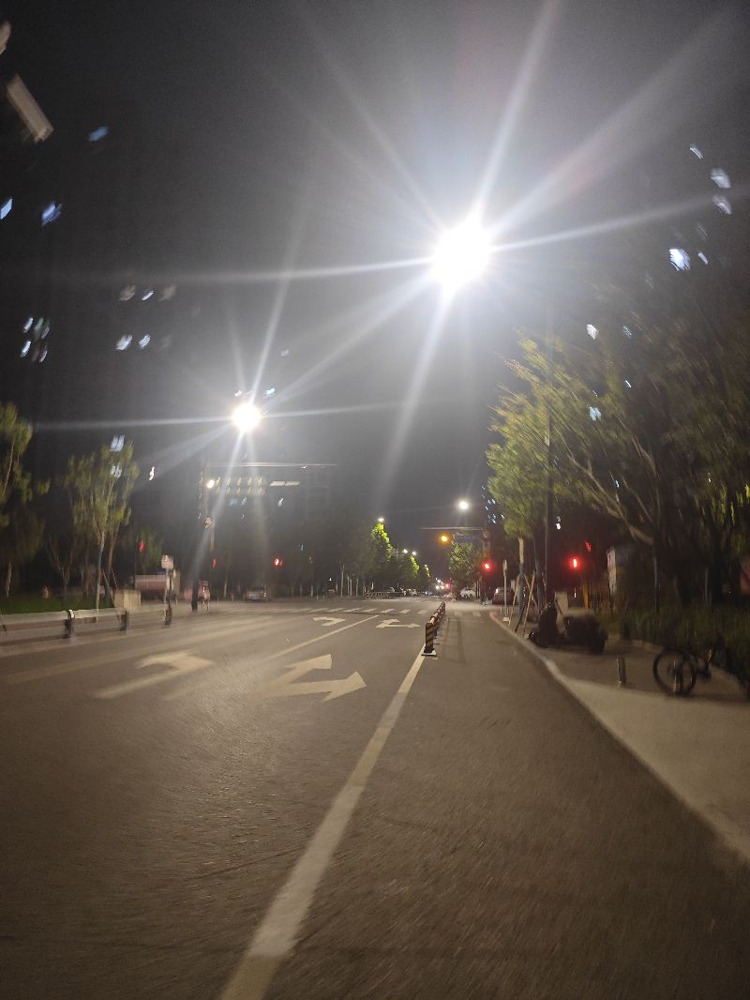
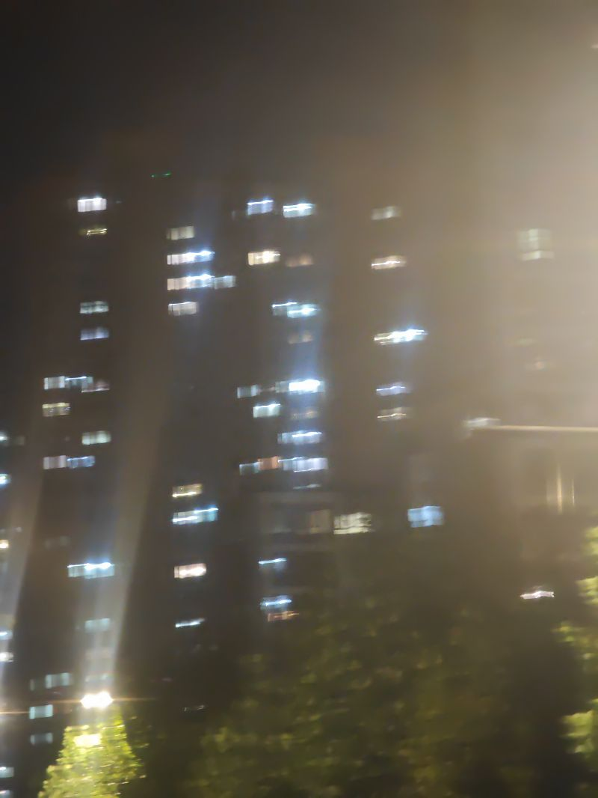
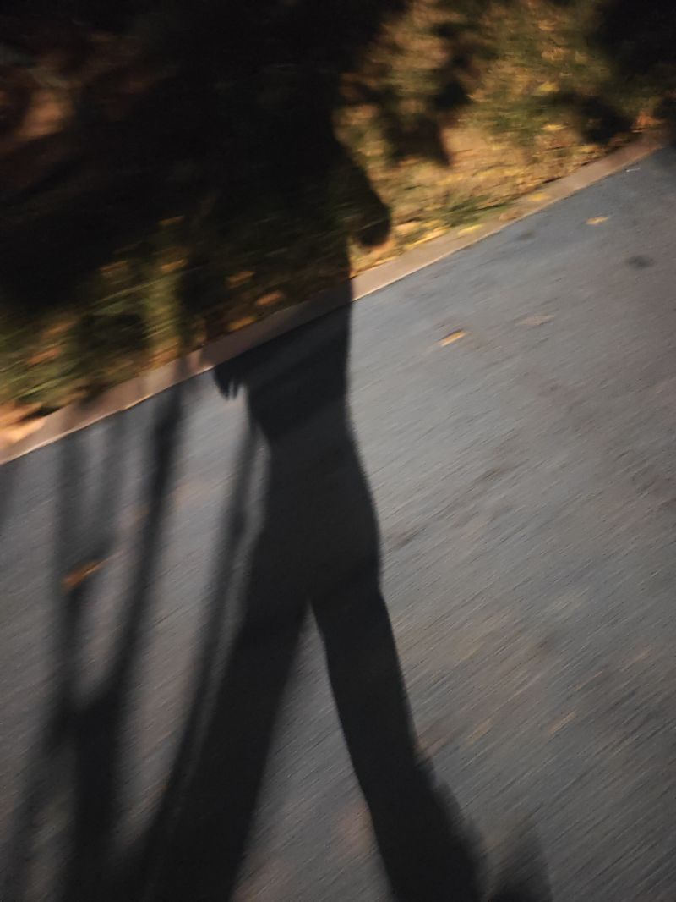
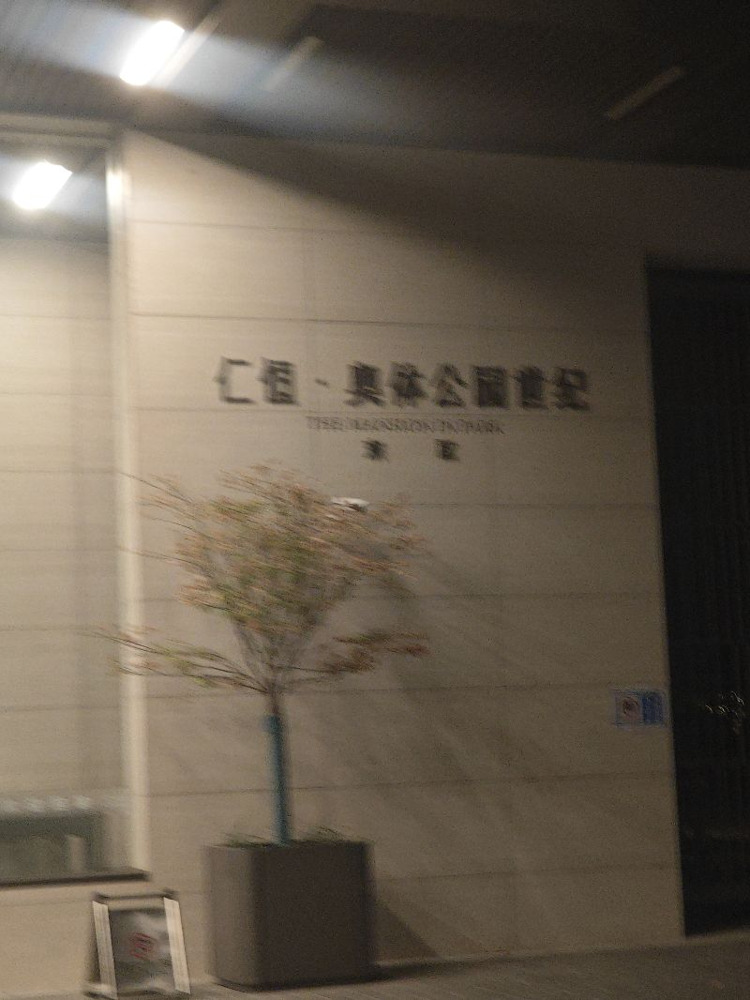

夜的灯光昏黄。我们总在追逐，总在忙碌，却很少停下来，享受此刻的宁静。

远处的高楼在闪烁的光芒中矗立，而自己的双脚在地上踏出的，只有自己的影子。我们每个人努力的方向和到达的目标，是否在一条线上？我们每天审视自己的时候，成功与否，今天至于明天的意义，此刻至于此生的精髓，究竟是什么？

我们给自己划定了行动的栅栏，我们给自己标上了道德的绳索，我们在这个世界上不断缩减自己的空间。我们是否成功，是否合乎标准，只在于我们自己的内心，对自己的看法。

亿万的人面对千万的人，低下着头颅；千万的人面对亿万的人，低下了头颅。千万的人面对强权，畏缩不前；我们面对镰刀斧头，惶惶不可终日。

每个人都是自主的，我们天生具备自己想要的选择。当我们在向外求的过程中，一边行走，一边失去；当我们向内求的时候，一边行走，一边收获。怎样活着，当我们可以自主地选择，怎样爱，是我们主动的创造；怎样理解，是我们创造的自觉。

我们应该活成我们自己，我们要去做自己。我们无需被世俗所裹挟，我们也无需愤世嫉俗。当我们以水自柔，所以无不可，就是以不问水是否浑浊的心态去徜徉在这个世界上的时候，我们就是在做自己，就是在向自己而生。

能做自己，难道不是我们来到这个世界上的终极吗？

