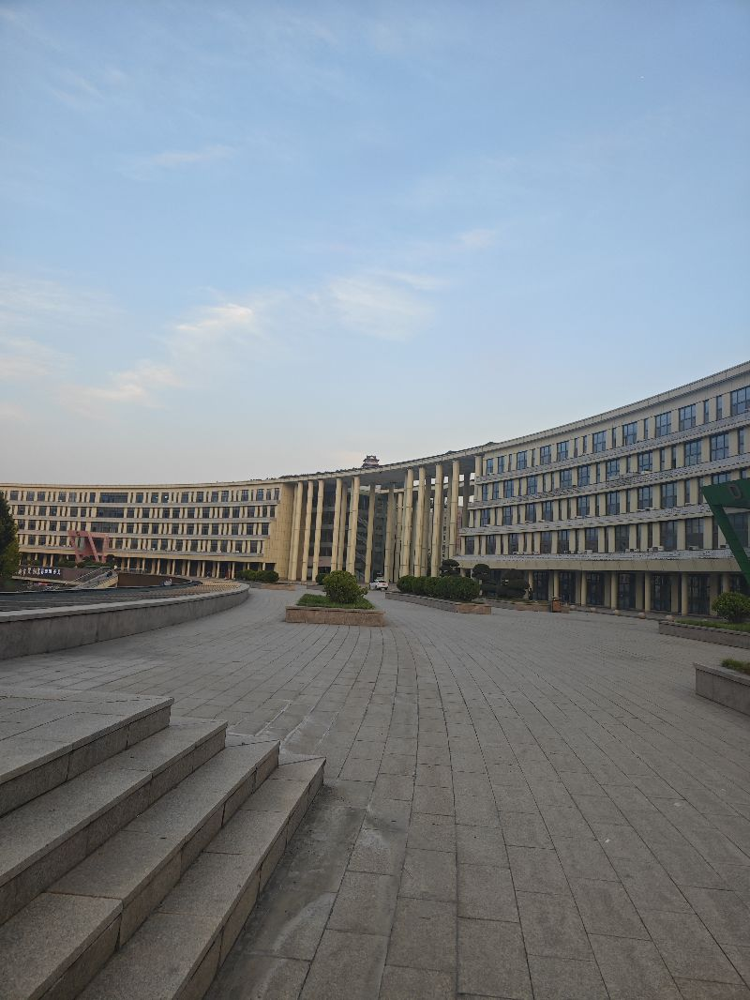

最近呢一直在用人工智能学习哲学，但是呢这里面我学的时候很彷徨啊，因为他给出了不同的大家的一些理论啊，这个人有什么理论，那个人有什么理论，但是呢好像是来来回回都是这样的理论，比如修木的理论啊，比如不信的理论，什么应然施然呢，这个世界呃最终的例子怎么组成之类的这个东西对我有什么意义呢，我在反思，我在询问我来找答案，这个最后呢我实在是受不了了，我就问他，我说我们都在学哲学学的目的是什么，我需要知道一个目论什么啊，人工智能总算是给我了一个正确答案，就是首先呢学了那么多各名家的理论，它只是用来增加我们的见识，也就是说这些理论看看他们这些前人是怎么思考的，然后呢，学完这些之后才能过渡到哲学，真正的目的是让我们学会学会啊如何去思考，如何去思考啊，训练我们的思考能力，从而让我们变得更加开明审慎，这才是目的啊，就是哲它的本意就是智慧哲学并不等于一套灌输智慧，最终是让我们学会了一套提问，论证反思的方法，这就有点这个现在人工智能里边的scale这个感觉哈就是，他并不是去记录这些知识，而是最终呢找到了一套方法，就是我们学到的是一套解决问题的方法，最终学完哲学，我们可能大脑里边遇到一些问题，我们立即知道该怎么样去分析，该怎么样找到答案，怎么样去解决这个问题，这才是哲学的，嗯，最终学习的目的很有收，很有收获，这实是通过人工智能可以让我们快速变得更强，不然的话我们买了很多哲学书，可能我们读完几年之后才能想象到哦，原来目的是这样，这也是，

