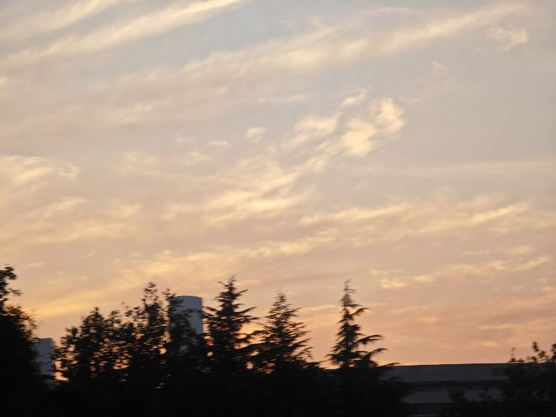
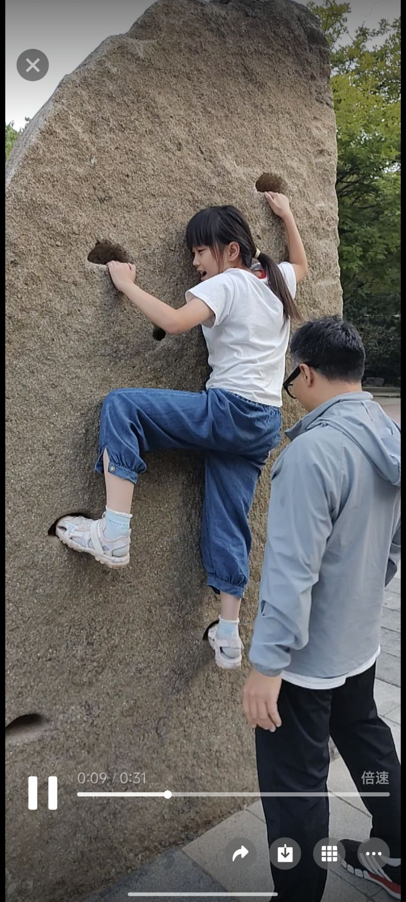

刚才带孩子出来玩，他要爬院子里的大石头，这个我协助他那个时候就发现了这个他的谨慎就也可以理解为是胆小，他从小就是一个非常谨慎的孩子，谨慎的有点过头，这可能是遗传啊，他表哥刘嘉玲也是这样的一个性格，小的时候，就是这边的一个陆岩石，他都不敢上去，现在呢那个孩子的胆子还不是特别大，但是呢已经好了很多，毕竟是男孩嘛，他相对会劈一些会思考，而我们家宝贝呢就一直是属于那种谨小慎微型的呵，像他这样一个石头叽叽喳喳，最终啊如果不是他妈妈录下来，他仅仅是觉得好笑，录下来一看会觉得啊太谨小慎微了，但是每个孩子来到这个世界上，都有他自己特殊的目的啊，我们应应该我们我们要按我们的是指定的路线去走，每个人都要修自己的道，我们承担我们的义务，但我们要走自己的道，没有什么是对还是错，或许我们早就已经被注定了，是宇宙写下的，必然也可能是我们每个人都有自己的特殊之处，我们都在去践行去寻找自己此生的目标，

