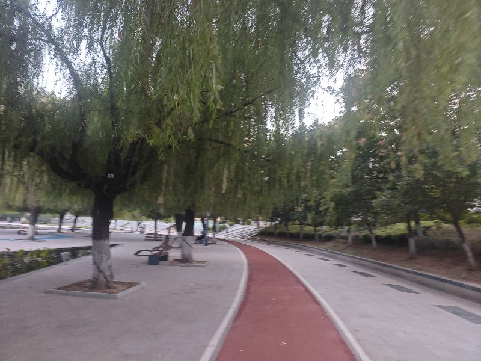

今天一直在思考周边的资源链接观，整体在感觉这样的项目在梳性到底有多大，但使用周边的账号豆报账号在梳理相应的界面啊，一边梳理呢一边感慨人工智能的强大，现在人工智能太强了，在做产品这一块已已经完全压压力类，但这个过程中更多的完不行的的做什么，是我们在不停的与人工智能，在对答过程中嗯使对产品的理解，但这个过程中还出相应的价值点来推进实现方案，这个过程程中不是我们们工工能，他因为并不是他的理解方式，也就是这种概率的方式来来思考，这个世界他对价值判断目前更多还是依赖于呃一系列的这种呃，应该算是经验吧，因为呢他可能完全依赖人工智能，我们还是处于我们们类的时时我我们发动机的这么一个阶段，也就说说们的的候候，我们要指它，他往个方向走，也前还的时代已经来临，的时代还在路上，这是不这是不同的思考，不同的维度，

