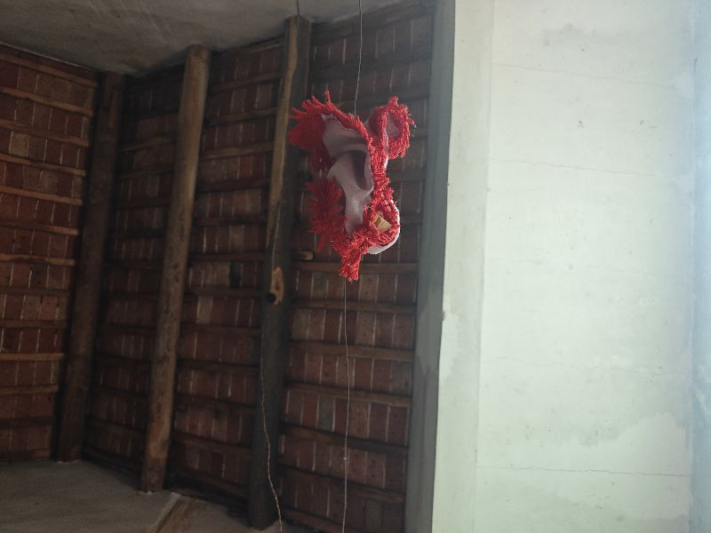
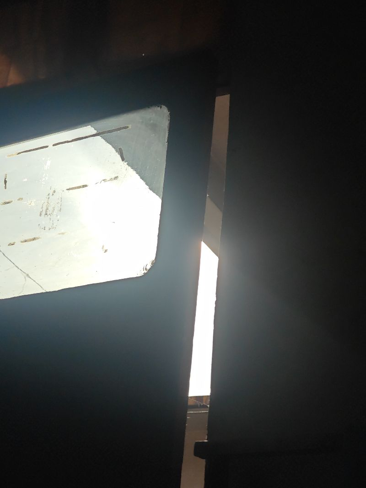

睡在了自己我们后面出生的地方，在东边这个屋里面，在初中的时候，我就在这里思考人生我终产生的思考，但也没有什么太多的感觉，但是当时的思考就像在鸡窝里思考，如何能够抓更多虫子，在这里面思考，可能就是自己能不能考上大学，但具体什么是大学也不清晰思考哪一个女孩更漂亮，但愿意和谁成为一对思考自己，能够能能能能够够欺欺负我自己自己可以打学呐，就就当当一个人，一代人，当自几代人被限制思思考力力后后，最终产生的思想，最最就是什么能逼逼的思，而而那那种土鸡挖狗一样的悲哀的的人，我我们怕被限制了，想象里我们我们相当于被扼住了喉咙的我们们被凹嗷的声音都发不出来，因为我们并不明白我们生存的目的是什么，甚我们最怕的就是在想象力端就被扼杀了，我们不怕后面全压迫，我们怕的是想象象里已经被被完全统一狗，思维所禁锢，我们没有方法，没有能力诞生出改变世界的这种能力和想法，

