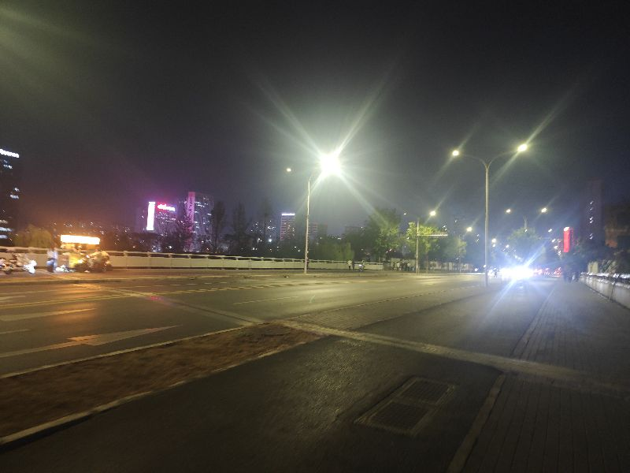

刚才跟刘大哥一起喝羊汤，聊到了人家 OPC 公司是怎么做的。这确实是一门做短剧的生意，但真正能快速赚钱的，还是教育——教会你技能、让你多赚一点。这个赛道依然充满了很多问题。

我查了一下，今年短剧的数据竟然达到了一千两百多亿，短剧赛道的数据是五百多亿，去年是四百多亿，也就是说这一年翻了一倍多。人们都被这种无脑短剧洗过去了，我真的很心痛。虽然我自己也做与短剧相关的东西，但每次看短剧的时候，我都觉得我们是在逃避。里面的穿越剧情，一点社会现实都不敢讲，全是迷迷之音，活在这种虚假的叙事中。这样的东西能给我们带来什么？让我们每个人更加逃避。你现在做事情、理解事物，都像这种产物一样去推进。

所以这个时候真的觉得，我们这个民族难道要在这样的地方消耗吗？真的非常悲哀。这个社会又统一达成了这种默契——你只要产生这样的内容，就可以赚到钱；而你产生那些有价值的内容，可能连最基本的生存都很难维持。但实际上，短剧这个赛道里冲进去的这么多人，把这个赛道拱得可能连生存都不容易了。

还好，现在短剧已经实际上向慢剧扩展了。以前短剧讲究的是快速迭代的各种剧情，而现在实际上已经跨越了那个阶段。现在你看各种书籍，可以说几乎跟原来写的完全一样，直接按照原来的剧情开展就可以了。它变成了一种类似于像天蚕土豆、辰东他们写的那种相对较慢、比较牛逼的小说，直接原样按那种剧情开展，就可以做长期的短剧，而且一集一集地出。当然，还是那句话，这是一种剧式，这不是文学，它还是剧。

同样，按照更大的照象来看，很难想象生活在短剧中、从小看短剧的孩子长大了会是什么样的。他可曾了解世界的真实？可曾知道这样的真相？可曾知道是谁让你活在这样的世界？是谁知道了这些噪音？为什么周边充斥着这样的噪音？

