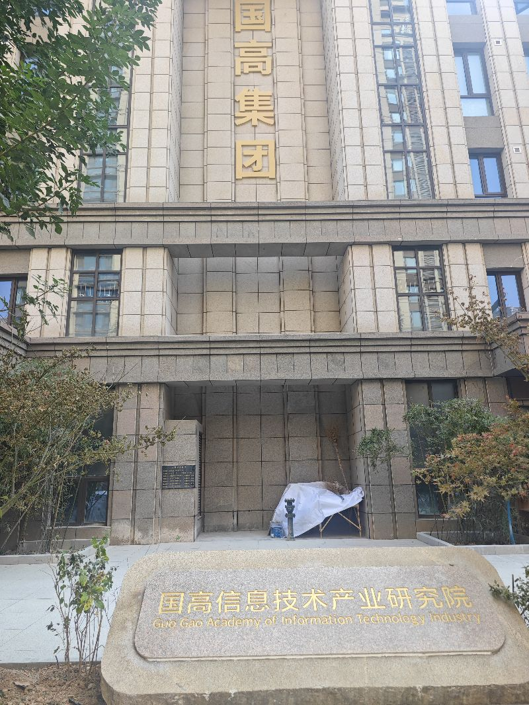
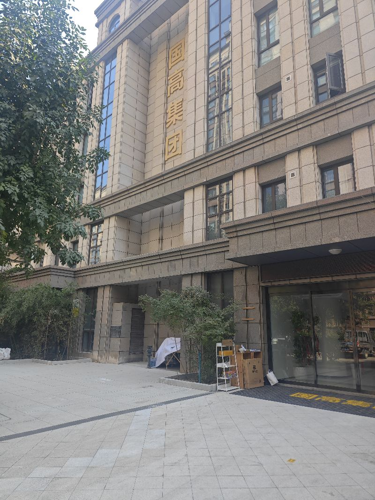
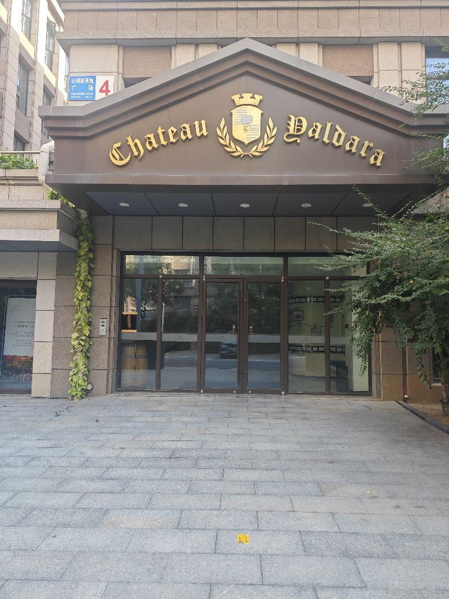

前两天说这个朗朗教育现在是拆迁啊，也可能是搬家，真可能是倒闭，现在来看大概率是倒闭了，今天从这儿经过发现当时的挂的这个国高集团真的就是国高集团了嗯，一家不错的教育企业就这么黄了，当然从发展的角度来讲，现在恰好是啊人口在减少整个教育，现在从问题的阶段嗯这种持续的变更带来的这种生产关系的这种变化到底要到什么程度，目前来看，我们还不相信，嗯，以前来说说某一个东西要不要倒闭，加什么东西会是一个大西，当时还不相信，但是现在来看的话，人家当初的这种判断是多么的准准确，这是一个什么个个的澳大利亚进口的红酒的一个基地，现在也完蛋了，期待经济能够尽快有所起色，老百姓能够赚到更多钱吧，

